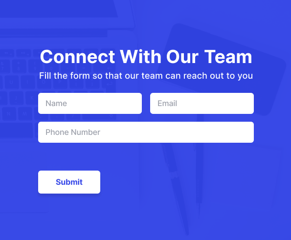
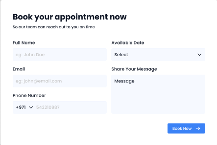
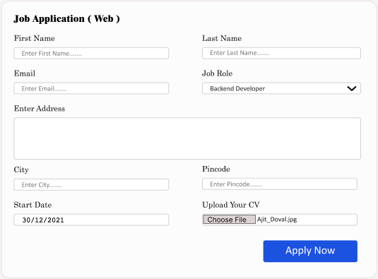

This project contains an example of how to use CSS Grid to design flexibe responsive web pages.

Prepared by web development Anderson Santos as part of his lessons on Web Development.

# Stack:

HTML5 & CSS3

# Design Credits

## Contact us Forms UI Design

Author: Faizan Ali

Link: https://www.figma.com/community/file/1285223148135860491

## contact us | #dailyui

Author: Rabia Israr

Link: https://www.figma.com/community/file/1211313973694658452

## Simple Contact Form - Book an Appointment

Author: Bejoy

Link: https://www.figma.com/community/file/1295835845531190620

## Job Application Form

Author: Nitish Sharma

Link: https://www.figma.com/community/file/1199220142157640683

